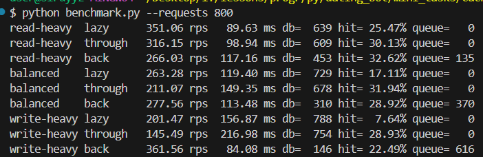
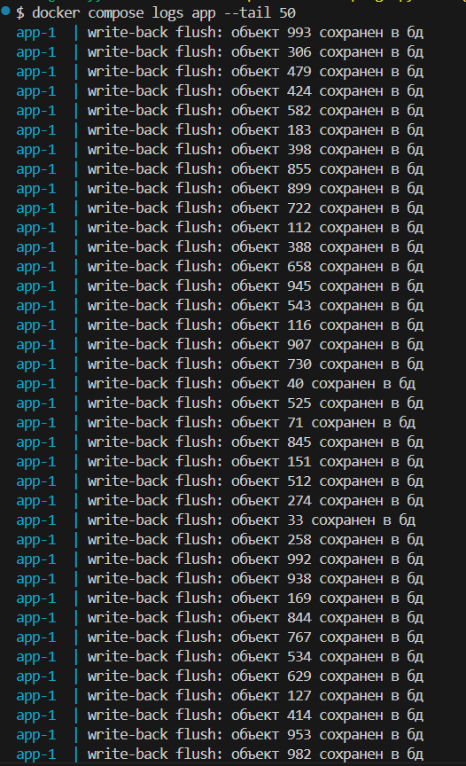

# практическое задание 3: сравнение типов кеширования

### результаты тестов (800 запросов на каждый тест): 
* сводная таблица результатов:

| нагрузка (Read/Write) | стратегия (Cache) | пропускная способность | средняя задержка | обращения в БД | hit rate | очередь (Write-Back) |
| :--- | :--- | :--- | :--- | :--- | :--- | :--- |
| read-heavy (80/20) | lazy | 351.06 RPS | 89.63 ms | 639 | 25.47% | 0 |
| read-heavy (80/20) | through | 316.15 RPS | 98.94 ms | 609 | 30.13% | 0 |
| read-heavy (80/20) | back | 266.03 RPS | 117.16 ms | 453 | 32.62% | 135 |
| balanced (50/50) | lazy | 263.28 RPS | 119.40 ms | 729 | 17.11% | 0 |
| balanced (50/50) | through | 211.07 RPS | 149.35 ms | 678 | 31.94% | 0 |
| balanced (50/50) | back | 277.56 RPS | 113.48 ms | 310 | 28.92% | 370 |
| write-heavy (20/80) | lazy | 201.47 RPS | 156.87 ms | 788 | 7.64% | 0 |
| write-heavy (20/80) | through | 145.49 RPS | 216.98 ms | 754 | 28.93% | 0 |
| write-heavy (20/80) | back | 361.56 RPS | 84.08 ms | 146 | 22.49% | 616 |

### Write-Back быстрее на запись - Write-Through надежнее
* write-back работает напрямую с RAM (Redis), откладывая синхронную запись в медленную БД (PostgreSQL) на потом, поэтому он обходит всех на write-heavy нагрузке (выдал 361 RPS с минимальной задержкой в 84 ms);
* write-through пишет данные сразу и в кеш, и в БД синхронно. Из-за двух сетевых походов он самый медленный на запись (всего 145 RPS), но зато идеален для данных, где нужна 100% консистентность и сохранность;
* lazy loading отлично справляется с читающей нагрузкой (read-heavy), так как быстро отдает данные из кеша (351 RPS), но проседает при записи, так как пишет напрямую в базу

### итог:
* какая стратегия лучше для смешанной нагрузки (balanced) - для сбалансированной нагрузки 50/50 лучше всего подходит Write-Back, так как он сглаживает пики записи (не блокируя базу данных) и при этом достаточно быстро отдает данные на чтение. Lazy Loading при 50% записи начинает сильно тормозить из-за постоянных синхронных инсертов в БД

## результаты: 

## write back flush:
