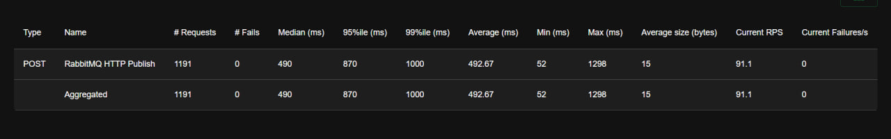
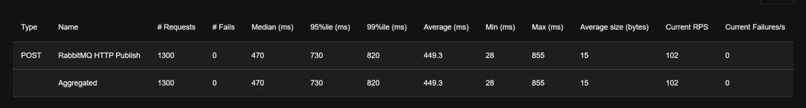
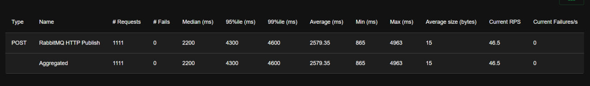
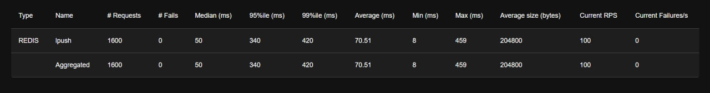

# практическое задание 2: сравнение RabbitMQ и Redis

### результаты тестов (100 RPS): 
* результаты сравнения тут:
    https://docs.google.com/spreadsheets/d/1YSqfepzdWwkrddpB_MYDaiINKdUScpxxQu0GdtU8R38/edit?usp=sharing

### Redis быстрее - Rabbitmq надежнее
* редис работает в RAM, реббит с диском для сохранности сообщений(а запись на диск снижает скорость);
* в данном тесте rabbitmq работал через HTTP API(потому что сокеты не хотели работать асинхронно на виндовсе:( ); redis в свою очередь работает с бинарным протоколом + он обрабатывает данные в одном потоке;
* реббит поддерживает подтверждение: если клиент упал, сообщение вернется в очередь; а редис идеален для данных, где потеря сообщения не критична.

### работа rabbitmq при 128 B

### работа rabbitmq при 1 KB

### работа rabbitmq при 10 KB

### работа rabbitmq при 100 KB

### работа redis при 128 B

### работа redis при 1 KB

### работа redis при 10 KB

### работа redis при 100 KB

### итог:
* какой брокер показал большую пропускную способность - redis, потому что работает в оп. памяти и однопоточно;

* какой брокер лучше переносит увеличение размера сообщения - redis, потому что не сохраняет ничего на диск, как реббит, а просто копирует кусок памяти;

* при какой нагрузке single instance RabbitMQ и single instance Redis начинают деградировать - rabbit начинает тупеть при RPS около 13-15тыс или при размере сообщения больше 10KB; redis выдерживает RPS около 60тыс, тупеть начинает, когда сообщения весят около 100KB + при высоком RPS; 

* какой инструмент лучше подходит для такого сценария и почему - redis - если нужна минимальная задержка, rabbitMQ - если требуется гарантированная дсотавка или сохранность данных после перезагрузки сервера;