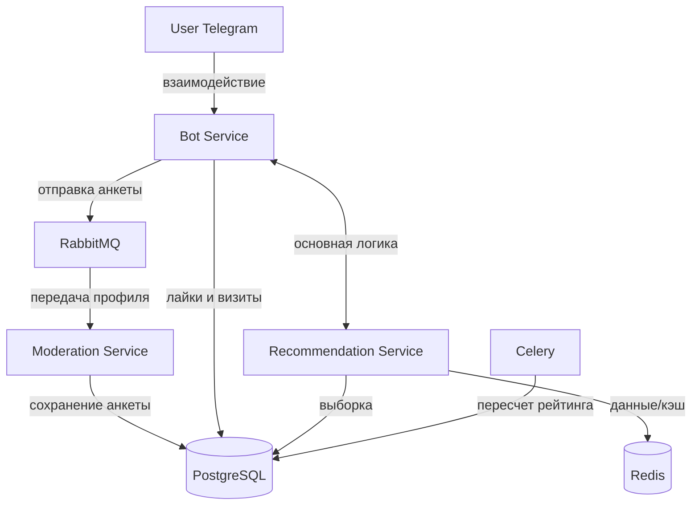
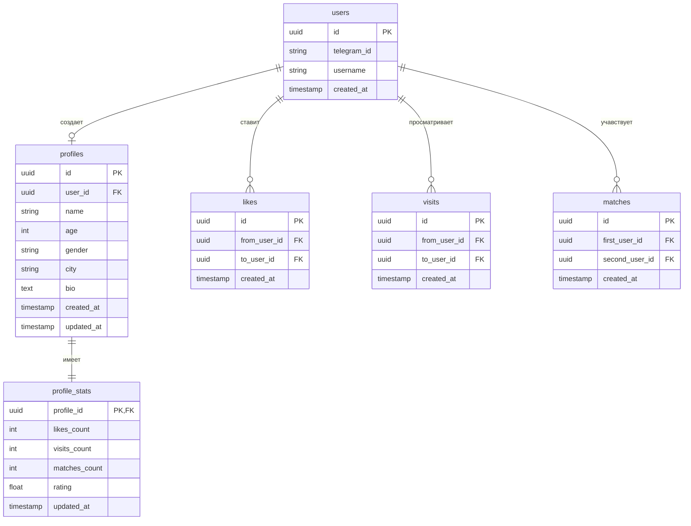

# Dating Bot

## Описание проекта

Telegram-бот для знакомств. Пользователь регистрируется через Telegram, заполняет анкету, после чего может просматривать анкеты других пользователей, ставить лайки или пропускать их(для демонстрации будут использоваться моковые анкеты)

Система состоит из: сервис бота, сервис модерации, сервис рекомендаций, а также PostgreSQL, Redis, RabbitMQ и Celery

## Описание сервисов

### 1. Bot Service

Bot Service отвечает за взаимодействие с подьзователем через telegram API

Функции:
- обработка команды `/start`
- регистрация пользователя(через id юзера)
- запуск заполнения анкеты
- показ анкет
- обработка действий пользователя: лайк, пропуск
- получение следующей анкеты через Recommendation Service

Bot Service не является основой, он передаёт запросы в другие сервисы

Примеры сценариев:
- пользователь запускает бота
- пользователь заполняет анкету
- пользователь нажимает лайк
- пользователь запрашивает следующую анкету

---

### 2. Moderation Service

Moderation Service отвечает за проверку анкеты после этапа регистрации и редактирования

Функции:
- проверка имени пользователя
- проверка текста анкеты
- отклонение некорректных данных
- подтверждение, что анкета валидна

Пример использования:
- модератор через этот сервис вручную отсматривает анкету и выносит вердикт (ок/неок)

---

### 3. Recommendation Service

Recommendation Service является основным сервисом системы и содержит основную бизнес-логику

Функции:
- получение анкет из PostgreSQL
- фильтрация анкет
- исключение уже просмотренных анкет
- сортировка анкет по рейтингу
- выдача следующей анкеты пользователю
- работа с Redis для ускорения выдачи
- учёт лайков при формировании рейтинга

Логика работы:
- при начале сессии сервис получает анкету пользователя
- подбирает список подходящих анкет
- первая анкета может быть выдана сразу
- следующие анкеты заранее сохраняются в Redis
- когда список в Redis заканчивается, сервис формирует новый список

## Технологии

### PostgreSQL

PostgreSQL используется как основное хранилище данных

В базе данных хранятся:
- пользователи
- анкеты
- лайки
- количество лайков
- рейтинги анкет

---

### Redis

Redis используется для кэширования предварительно подготовленного списка анкет(для выдачи)

Назначение:
- уменьшение задержки при показе анкет
- хранение очереди рекомендаций для пользователя
- снижение нагрузки на PostgreSQL

Пример:
- Recommendation Service подготавливает 10 анкет
- список сохраняется в Redis
- Bot Service получает анкеты быстрее
- после окончания списка Recommendation Service формирует новый

---

### Celery

Celery используется для фоновых задач

Назначение:
- пересчёт рейтингов анкет

Пример:
- периодический пересчёт рейтинга анкет на основе лайков
- обновление подготовленных данных для Recommendation Service

---

### RabbitMQ

RabbitMQ используется как брокер сообщений для взаимодействия между сервисами

Назначение:
- передача анкет из Bot Service в Moderation Service
- асинхронная обработка данных

Пример:
- пользователь заполняет анкету
- Bot Service отправляет анкету в очередь RabbitMQ
- Moderation Service получает сообщение из очереди
- выполняет проверку данных
- результат проверки возвращается в систему

## Архитектура

1. Пользователь отправляет команду в Telegram  
2. Bot Service принимает запрос  
3. При регистрации анкета отправляется в RabbitMQ  
4. Moderation Service получает анкету из очереди  
5. После успешной проверки анкета сохраняется в PostgreSQL  
6. При запросе на просмотр анкет Bot Service обращается в Recommendation Service  
7. Recommendation Service получает данные из PostgreSQL и Redis  
8. Bot Service отправляет пользователю следующую анкету  
9. Лайки и скипы сохраняются в PostgreSQL  
10. Celery фоново пересчитывает рейтинги  

## Схема БД

users - таблица пользователей

поля:

- id
- telegram_id
- username
- created_at

profiles - таблица анкет пользователей

поля:

- id
- user_id
- name
- age
- gender
- city
- bio
- created_at
- updated_at

likes - таблица лайков

поля:

- id
- from_user_id
- to_user_id
- created_at

visits - таблица, хранящая данные о просмотре анкет, чтобы не дублировать пользователю анкеты

поля:

- id
- from_user_id
- to_user_id
- created_at

matches - таблица метчей

поля:

- id
- first_user_id
- second_user_id
- created_at

profile_stats - таблица статистики анкеты

поля:

- profile_id
- likes_count
- visits_count
- matches_count
- rating
- updated_at