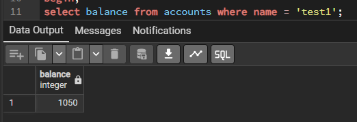
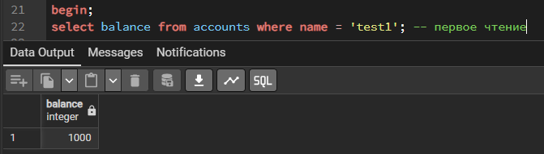
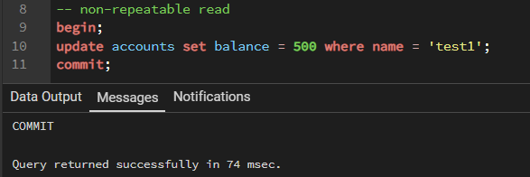
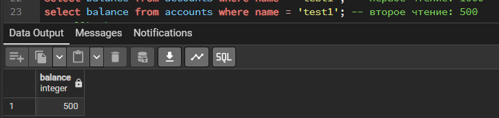
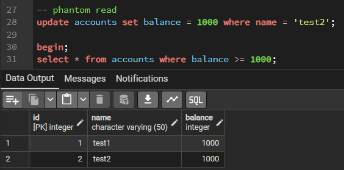
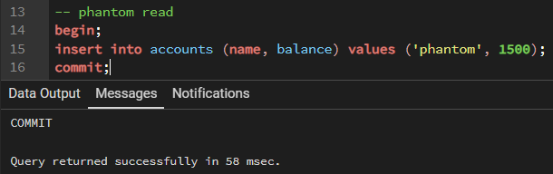
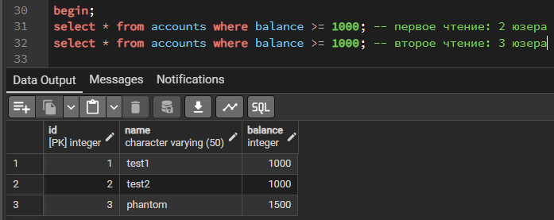
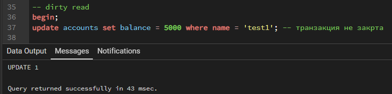
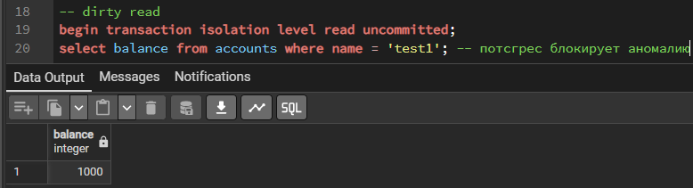

# практическое задание 4: аномалии изоляции в sql

### описание работы:
* тесты проводились на локальной базе данных postgresql через инструмент pgadmin (два независимых окна query tool);
* для каждой аномалии использовалась таблица `accounts` с тестовыми данными (test1 и test2 с балансом 1000);
* целью было зафиксировать возникновение аномалии и проверить встроенную защиту postgresql
* (1) - первое окно; (2) - второе окно

 

### сводная таблица аномалий:

| аномалия | результат в postgres (по умолчанию) | уровень изоляции для защиты |
| :--- | :--- | :--- |
| **lost update** | возникает (блокировка до коммита) | repeatable read / serializable |
| **non-repeatable read** | возникает (read committed) | repeatable read |
| **phantom read** | возникает (read committed) | repeatable read (в postgres) |
| **dirty read** | не возникает (защита по умолчанию) | read committed |

## lost update
* суть: две транзакции одновременно читают баланс (1000), прибавляют по 50 и пытаются сохранить. в итоге одна перезаписывает другую, и баланс становится 1050 вместо 1100;
* в postgres одна транзакция "засыпает" и ждет завершения другой при попытке `update` одной и той же строки

### первая транзакция изменила без commit'а

 

### вторая транзакция ждет азвершения

  

### коммитим изменения(1) и update сразу выполняется(2):

 

## итог:

### как избежать: 
использовать блокировку строк при чтении (запрос `select ... for update`), чтобы другие транзакции ждали своей очереди, либо поднять уровень изоляции до `repeatable read` или `serializable`

## non-repeatable read
* суть: внутри одной транзакции мы дважды читаем одну и ту же строку. между этими чтениями другая транзакция меняет данные и делает `commit`. в итоге первый процесс видит два разных результата
* аномалия: баланс test1 изменился прямо в процессе работы первой транзакции

   

### изменяем(2), не закрывая транзакцию(1):

### итог: в одной транзакции два select'a увидели разные результаты:

### как избежать: 
повысить уровень изоляции до `repeatable read`. тогда база сделает "снимок" данных на момент старта транзакции и не увидит чужих изменений, даже если они были закоммичены

## phantom read
* суть: при повторном чтении диапазона строк (например, `balance >= 1000`) появляются новые записи, которые были вставлены и зафиксированы другой транзакцией;
* в тесте появился "фантомный" пользователь phantom, которого не было при первом поиске

### изначально(1):

### добавили фантома(2):

### итог: новая запись другой транзакции(1)

### как избежать: 
нужен уровень `serializable`, но в postgresql достаточно включить `repeatable read`(механизм многоверсионности (mvcc) защищает от появления фантомов)

## dirty read
* суть: чтение данных, которые были изменены другой транзакцией, но еще не зафиксированы (`commit`);
* в postgres аномалия не воспроизводится даже на уровне `read uncommitted`, так как база данных физически не отдает незафиксированные изменения другим процессам

(1)

(2)

### как избежать: 
использовать уровень изоляции `read committed` (в postgres он работает по умолчанию). он запрещает читать данные, пока другая транзакция не сделает `commit`
